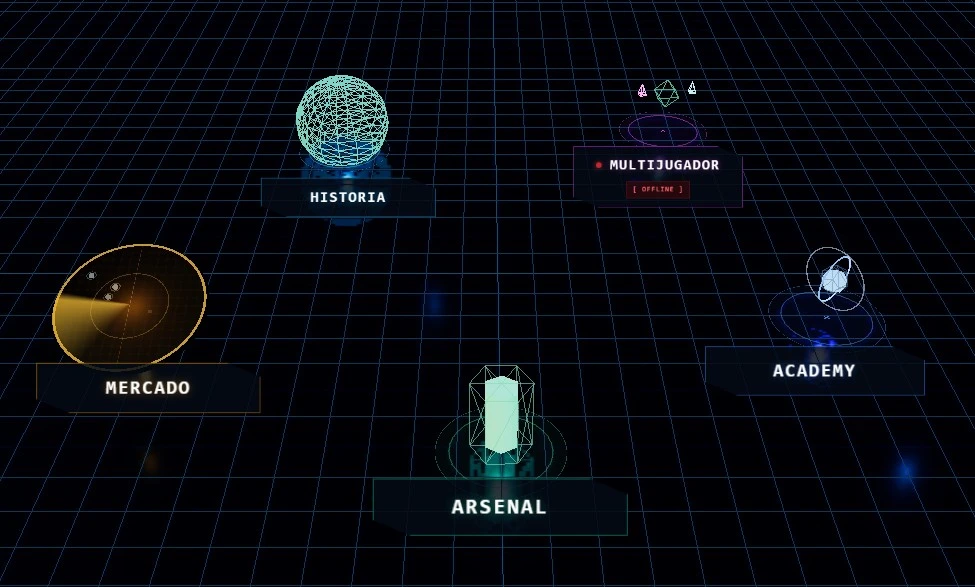
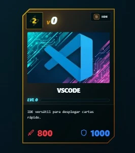
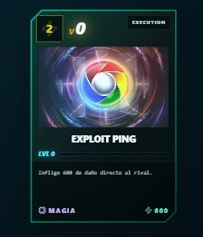

<!-- README.md - Guía principal profesional de AI-GI-OH como producto en producción v1.0.0. -->
# AI-GI-OH

<p align="center">
  <strong>Producto en producción · v1.0.0</strong><br/>
  Juego táctico de cartas con motor desacoplado, arquitectura por capas y flujo profesional de calidad.
</p>

<p align="center">
  <a href="https://ai-gi-oh.vercel.app"><strong>🌐 App en producción</strong></a> ·
  <a href="./CONTRIBUTING.md"><strong>🤝 Contribuir</strong></a> ·
  <a href="./docs/GUIA_DESPLIEGUE_PROFESIONAL.md"><strong>🚀 Deploy</strong></a> ·
  <a href="./docs/architecture/README.md"><strong>🏗️ Arquitectura</strong></a>
</p>

<p align="center">
  
  
  
  
  
</p>

## Tabla de contenidos

1. [Qué es AI-GI-OH](#qué-es-ai-gi-oh)
2. [Vista rápida del producto](#vista-rápida-del-producto)
3. [Stack tecnológico](#stack-tecnológico)
4. [Inicio rápido local (5 min)](#inicio-rápido-local-5-min)
5. [Contribución profesional](#contribución-profesional)
6. [Despliegue profesional](#despliegue-profesional)
7. [Variables de entorno](#variables-de-entorno)
8. [Scripts de ingeniería](#scripts-de-ingeniería)
9. [Arquitectura y estructura](#arquitectura-y-estructura)
10. [Módulos funcionales](#módulos-funcionales)
11. [Calidad y merge](#calidad-y-merge)
12. [Presentación TFM](#presentación-tfm)
13. [Mapa de documentación](#mapa-de-documentación)

## Qué es AI-GI-OH

AI-GI-OH es un juego táctico de cartas desarrollado como producto real, no demo técnica.

Incluye:

- Combate por turnos con fases, efectos y fusión.
- `combatLog` como fuente canónica de historial, UI y feedback.
- Persistencia de progreso, economía y narrativa en Supabase.
- Hub con módulos `Home`, `Market`, `Story`, `Academy` y `Multiplayer`.
- Panel admin para gestionar contenido sin tocar código.

Producción actual:

- App: `https://ai-gi-oh.vercel.app`
- Callback auth: `https://ai-gi-oh.vercel.app/auth/callback`

## Vista rápida del producto

<table>
  <tr>
    <td align="center"><strong>Hub UI</strong></td>
  </tr>
  <tr>
    <td></td>
  </tr>
</table>

<table>
  <tr>
    <td align="center"><strong>Render carta</strong></td>
    <td align="center"><strong>Carta técnica</strong></td>
    <td align="center"><strong>Oponente</strong></td>
    <td align="center"><strong>Fusión</strong></td>
  </tr>
  <tr>
    <td></td>
    <td></td>
    <td></td>
    <td></td>
  </tr>
</table>

## Stack tecnológico

- Next.js 16 (App Router)
- React 19
- TypeScript estricto
- Zustand
- Supabase (`@supabase/ssr`, `@supabase/supabase-js`)
- Vitest + React Testing Library
- Playwright E2E
- ESLint

## Inicio rápido local (5 min)

Requisitos:

- Node.js 20+
- pnpm
- Docker Desktop

Arranque recomendado:

```bash
pnpm install
pnpm supabase:bootstrap:local
pnpm supabase:env:apply
pnpm dev
```

URLs locales:

- App: `http://localhost:3000`
- Hub: `http://localhost:3000/hub`
- Supabase Studio: `http://127.0.0.1:54323`

## Contribución profesional

Antes de tocar código, debes seguir la guía oficial:

- [CONTRIBUTING.md](./CONTRIBUTING.md)

Flujo estándar de contribución:

1. Crear branch desde `develop`.
2. Implementar cambio con tests co-localizados.
3. Ejecutar gates locales.
4. Abrir PR `develop -> main` cuando corresponda release.

Validación mínima previa a PR:

```bash
pnpm lint
pnpm typecheck
pnpm test:coverage
pnpm build
```

## Despliegue profesional

Guía completa:

- [docs/GUIA_DESPLIEGUE_PROFESIONAL.md](./docs/GUIA_DESPLIEGUE_PROFESIONAL.md)

Onboarding técnico obligatorio para contributors:

- [CONTRIBUTING.md](./CONTRIBUTING.md)

Checklist resumida:

1. Configurar variables de entorno en Vercel y Supabase.
2. Verificar callbacks de auth (`/auth/callback`).
3. Confirmar que quality gates están en verde.
4. Publicar cambios vía flujo de PR y merge.
5. Crear release/tag desde versión de `package.json`.

Documentación relacionada:

- [docs/GUIA_FLUJO_PRODUCCION.md](./docs/GUIA_FLUJO_PRODUCCION.md)
- [docs/GUIA_RELEASES.md](./docs/GUIA_RELEASES.md)
- [CHANGELOG.md](./CHANGELOG.md)

## Variables de entorno

Plantilla base:

- [`.env.example`](./.env.example)

Críticas para funcionamiento:

- `NEXT_PUBLIC_SUPABASE_URL`
- `NEXT_PUBLIC_SUPABASE_ANON_KEY`
- `SUPABASE_SERVICE_ROLE_KEY`

Hardening recomendado en staging/prod:

- `AUTH_RATE_LIMIT_REQUIRE_DISTRIBUTED`
- `AUTH_RATE_LIMIT_FAIL_CLOSED`
- `ADMIN_RATE_LIMIT_REQUIRE_DISTRIBUTED`
- `ADMIN_RATE_LIMIT_FAIL_CLOSED`
- `PLAYER_PROFILE_RATE_LIMIT_REQUIRE_DISTRIBUTED`
- `PLAYER_PROFILE_RATE_LIMIT_FAIL_CLOSED`
- `SECURITY_RATE_LIMIT_DISTRIBUTED_TIMEOUT_MS`

## Scripts de ingeniería

Calidad:

```bash
pnpm lint
pnpm typecheck
pnpm test
pnpm test:coverage
pnpm build
pnpm quality:check
```

E2E:

```bash
pnpm test:e2e
pnpm test:e2e:story:resilience
```

Seguridad:

```bash
pnpm security:rate-limit:check
pnpm security:audit:prod
```

Rendimiento:

```bash
pnpm perf:baseline:mobile
pnpm perf:baseline:mobile:realistic
pnpm perf:baseline:mobile:stress
```

Releases:

```bash
pnpm release:tag
pnpm release:tag:push
```

## Arquitectura y estructura

Dependencia permitida:

```text
components/app -> services/use-cases -> core
infrastructure implementa contratos de core
```

Estructura principal:

```text
src/app                 -> Rutas App Router y endpoints API
src/components          -> UI y composición visual
src/services            -> Orquestación de aplicación
src/core/use-cases      -> Casos de uso
src/core/services       -> Reglas de dominio puras
src/core/entities       -> Entidades y contratos
src/infrastructure      -> Adaptadores externos
docs                    -> Arquitectura, seguridad, performance y operación
```

Referencias:

- [Architecture.md](./Architecture.md)
- [docs/architecture/README.md](./docs/architecture/README.md)

## Módulos funcionales

- Hub principal de navegación.
- Home (colección, deck, evolución y fusión).
- Market (packs, listings y compra).
- Story (mapa, nodos, eventos y duelos).
- Academy (tutorial y training).
- Multiplayer (entrypoint en evolución).
- Admin dashboard de contenido.

## Calidad y merge

Gates obligatorios:

1. `pnpm lint`
2. `pnpm typecheck`
3. `pnpm test:coverage`
4. `pnpm build`

Criterios adicionales:

- Sin warnings nuevos.
- Tests junto al código (`co-location`).
- Documentación en español actualizada.
- Cumplimiento de [Agents.md](./Agents.md).

## Presentación TFM

- Ruta interna: `/presentacion-tfm`
- URL pública: `https://ai-gi-oh.vercel.app/presentacion-tfm`
- Guía: [docs/GUIA_PRESENTACION_TFM_WEB.md](./docs/GUIA_PRESENTACION_TFM_WEB.md)

## Mapa de documentación

Arquitectura:

- [Architecture.md](./Architecture.md)
- [docs/architecture/README.md](./docs/architecture/README.md)

Motor de juego:

- [MOTOR_JUEGO.md](./MOTOR_JUEGO.md)
- [docs/game-engine/README.md](./docs/game-engine/README.md)

Seguridad y persistencia:

- [docs/security/auth-hardening.md](./docs/security/auth-hardening.md)
- [docs/security/rate-limit-rollout.md](./docs/security/rate-limit-rollout.md)
- [docs/supabase/README.md](./docs/supabase/README.md)

Rendimiento:

- [docs/performance/README.md](./docs/performance/README.md)
- [docs/performance/PHASE-1-BASELINE.md](./docs/performance/PHASE-1-BASELINE.md)

Refactor y deuda técnica:

- [docs/refactor/GUIA-REFAC-STEP-BY-STEP.md](./docs/refactor/GUIA-REFAC-STEP-BY-STEP.md)
- [docs/DEUDA_TECNICA.md](./docs/DEUDA_TECNICA.md)

Memoria Engram:

- [docs/engram/engram-guia.md](./docs/engram/engram-guia.md)
- [skills/engram-memory-protocol/SKILL.md](./skills/engram-memory-protocol/SKILL.md)
